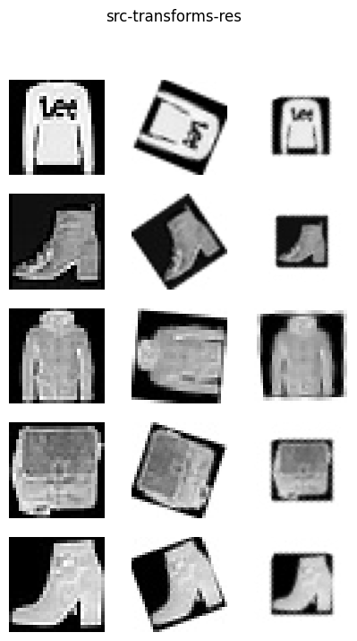

<div align="right">
  Language:
    🇺🇸
  <a title="Chinese" href="./README.zh-CN.md">🇨🇳</a>
</div>

 <div align="center"><a title="" href="https://github.com/ZJCV/RotNet"></a></div>

<p align="center">
  «RotNet» realizes image rotation correction based on deep learning
<br>
<br>
  <a href="https://github.com/RichardLitt/standard-readme"></a>
  <a href="https://conventionalcommits.org"></a>
  <a href="http://commitizen.github.io/cz-cli/"></a>
</p>



## Table of Contents

- [Table of Contents](#table-of-contents)
- [Background](#background)
- [Usage](#usage)
- [Maintainers](#maintainers)
- [Thanks](#thanks)
- [Contributing](#contributing)
- [License](#license)

## Background

Looking for information on the Internet, we found that the image rotation angle can be detected by deep learning algorithm. Refer to

* [d4nst/RotNet](https://github.com/d4nst/RotNet)
* [Correcting Image Orientation Using Convolutional Neural Networks](https://d4nst.github.io/2017/01/12/image-orientation/)
* [Image Orientation Estimation with Convolutional Networks](https://lmb.informatik.uni-freiburg.de/Publications/2015/FDB15/image_orientation.pdf)
* [UNSUPERVISED REPRESENTATION LEARNING BY PREDICTING IMAGE ROTATIONS](https://arxiv.org/pdf/1803.07728.pdf)

The corresponding implementation can't meet the current performance requirements, so I implement one myself

## Usage

* train

```
$ export PYTHONPATH=<root path>
$ CUDA_VISIBLE_DEVICES=0 python tools/train.py -cfg=configs/xxx.yaml
```

* test

```
$ export PYTHONPATH=<root path>
$ CUDA_VISIBLE_DEVICES=0 python demo/demo.py -cfg=demo/xxx.yaml
```

## Maintainers

* zhujian - *Initial work* - [zjykzj](https://github.com/zjykzj)

## Thanks

* [d4nst/RotNet](https://github.com/d4nst/RotNet)
* [ZJCV/ZCls](https://github.com/ZJCV/ZCls)

## Contributing

Anyone's participation is welcome! Open an [issue](https://github.com/ZJCV/RotNet/issues) or submit PRs.

Small note:

* Git submission specifications should be complied
  with [Conventional Commits](https://www.conventionalcommits.org/en/v1.0.0-beta.4/)
* If versioned, please conform to the [Semantic Versioning 2.0.0](https://semver.org) specification
* If editing the README, please conform to the [standard-readme](https://github.com/RichardLitt/standard-readme)
  specification.

## License

[Apache License 2.0](LICENSE) © 2020 zjykzj